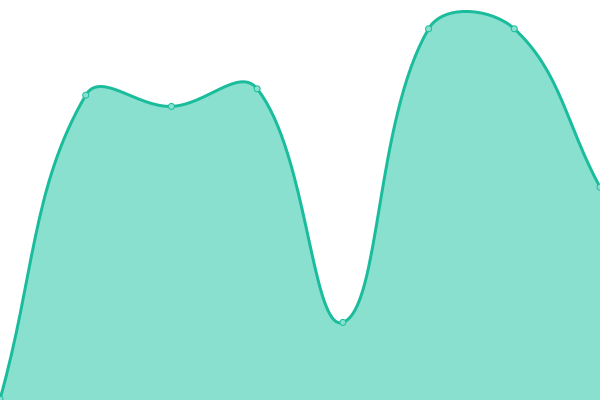

# [📈 在线状态](https://xxnet2017.github.io/xxnet-status): <!--live status--> **🟧 Partial outage**

This repository contains the open-source uptime monitor and status page for [xxnet2017](https://xxnet2017.github.io/xxnet-status), powered by [Upptime](https://github.com/upptime/upptime).

With [Upptime](https://upptime.js.org), you can get your own unlimited and free uptime monitor and status page, powered entirely by a GitHub repository. We use [Issues](https://github.com/xxnet2017/xxnet-status/issues) as incident reports, [Actions](https://github.com/xxnet2017/xxnet-status/actions) as uptime monitors, and [Pages](https://xxnet2017.github.io/xxnet-status) for the status page.

## [📈 Live Status](https://demo.upptime.js.org): <!--live status--> **🟧 Partial outage**

<!--start: status pages-->
<!-- This summary is generated by Upptime (https://github.com/upptime/upptime) -->
<!-- Do not edit this manually, your changes will be overwritten -->
<!-- prettier-ignore -->
| URL | Status | History | Response Time | Uptime |
| --- | ------ | ------- | ------------- | ------ |
|  [Google](https://www.google.com) | 在线 | [google.yml](https://github.com/xxnet2017/xxnet-status/commits/HEAD/history/google.yml) | 

 49ms
     
 | 

<a href="https://xxnet2017.github.io/xxnet-status/history/google">100.00%</a>
    

|  [Wikipedia](https://en.wikipedia.org) | 在线 | [wikipedia.yml](https://github.com/xxnet2017/xxnet-status/commits/HEAD/history/wikipedia.yml) | 

 226ms
     
 | 

<a href="https://xxnet2017.github.io/xxnet-status/history/wikipedia">100.00%</a>
    

|  [Hacker News](https://news.ycombinator.com) | 在线 | [hacker-news.yml](https://github.com/xxnet2017/xxnet-status/commits/HEAD/history/hacker-news.yml) | 

 407ms
     
 | 

<a href="https://xxnet2017.github.io/xxnet-status/history/hacker-news">100.00%</a>
    

|  [Test Broken Site](https://thissitedoesnotexist.koj.co) | 离线 | [test-broken-site.yml](https://github.com/xxnet2017/xxnet-status/commits/HEAD/history/test-broken-site.yml) | 

 0ms
     
 | 

<a href="https://xxnet2017.github.io/xxnet-status/history/test-broken-site">100.00%</a>
    

<!--end: status pages-->

[**Visit our status website →**](https://xxnet2017.github.io/xxnet-status)

## 📄 License

- Powered by: [Upptime](https://github.com/upptime/upptime)
- Code: [MIT](./LICENSE) © [xxnet2017](https://xxnet2017.github.io/xxnet-status)
- Data in the `./history` directory: [Open Database License](https://opendatacommons.org/licenses/odbl/1-0/)
