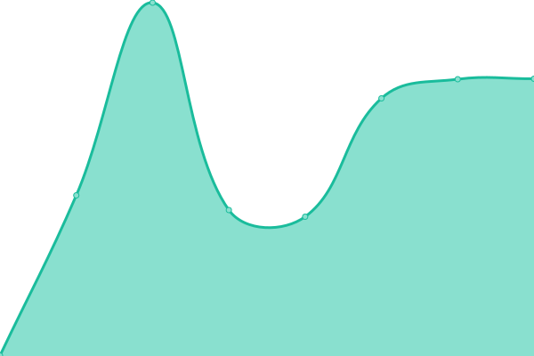
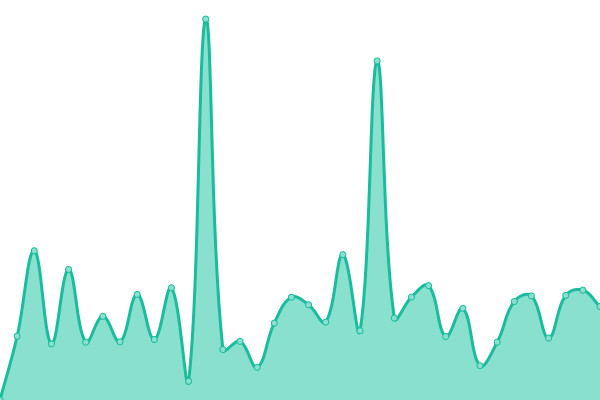
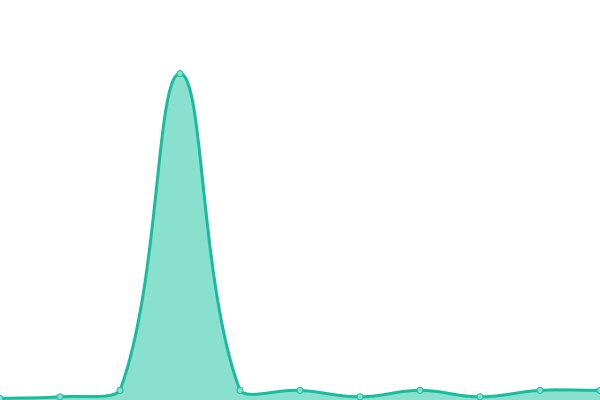
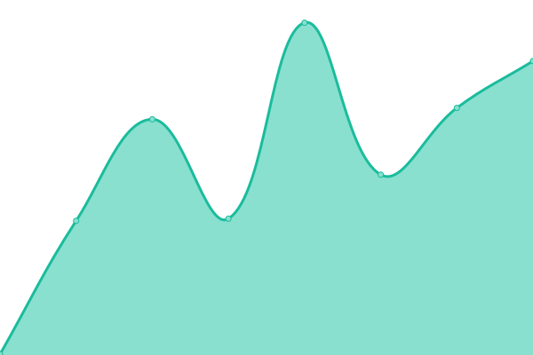
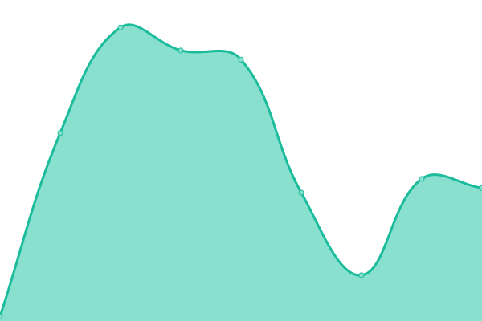
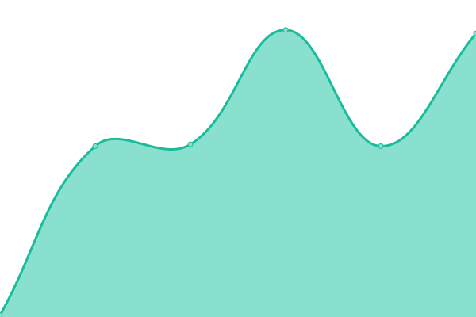

# [📈 在线状态](https://xxnet2017.github.io/xxnet-status): <!--live status--> **部分服务出现故障**

This repository contains the open-source uptime monitor and status page for [xxnet2017](https://xxnet2017.github.io/xxnet-status), powered by [Upptime](https://github.com/upptime/upptime).

With [Upptime](https://upptime.js.org), you can get your own unlimited and free uptime monitor and status page, powered entirely by a GitHub repository. We use [Issues](https://github.com/xxnet2017/xxnet-status/issues) as incident reports, [Actions](https://github.com/xxnet2017/xxnet-status/actions) as uptime monitors, and [Pages](https://xxnet2017.github.io/xxnet-status) for the status page.

## [📈 Live Status](https://demo.upptime.js.org): <!--live status--> **部分服务出现故障**

<!--start: status pages-->
<!-- This summary is generated by Upptime (https://github.com/upptime/upptime) -->
<!-- Do not edit this manually, your changes will be overwritten -->
<!-- prettier-ignore -->
| URL | 状态 | 历史 | 响应时间 | 全部响应时间 |
| --- | ------ | ------- | ------------- | ------ |
|  [猩猩互联主页 (XXNet Website)](https://xxnet.online) | 离线 | [xx-net-website.yml](https://github.com/xxnet2017/xxnet-status/commits/HEAD/history/xx-net-website.yml) | 

 0ms
     
 | 

<a href="https://status.wall.rip/history/xx-net-website">0.00%</a>
    

|  [订阅服务&客户端API (Subscribe Service & Client API)](https://wall.rip) | 在线 | [and-api-subscribe-service-and-client-api.yml](https://github.com/xxnet2017/xxnet-status/commits/HEAD/history/and-api-subscribe-service-and-client-api.yml) | 

 1168ms
     
 | 

<a href="https://status.wall.rip/history/and-api-subscribe-service-and-client-api">95.57%</a>
    

|  [Emby](https://cf.embyplus.club) | 离线 | [emby.yml](https://github.com/xxnet2017/xxnet-status/commits/HEAD/history/emby.yml) | 

 0ms
     
 | 

<a href="https://status.wall.rip/history/emby">0.00%</a>
    

|  🇨🇳 转发-广州移动 (Forward-GuangZhouCM) | 离线 | [forward-guang-zhou-cm.yml](https://github.com/xxnet2017/xxnet-status/commits/HEAD/history/forward-guang-zhou-cm.yml) | 

 0ms
     
 | 

<a href="https://status.wall.rip/history/forward-guang-zhou-cm">0.00%</a>
    

|  🇨🇳 转发-长沙联通 (Forward-ChangShaCU) | 在线 | [forward-chang-sha-cu.yml](https://github.com/xxnet2017/xxnet-status/commits/HEAD/history/forward-chang-sha-cu.yml) | 

 274ms
     
 | 

<a href="https://status.wall.rip/history/forward-chang-sha-cu">99.43%</a>
    

|  🇨🇳 转发-上海移动 (Forward-ShangHaiCM) | 离线 | [forward-shang-hai-cm.yml](https://github.com/xxnet2017/xxnet-status/commits/HEAD/history/forward-shang-hai-cm.yml) | 

 0ms
     
 | 

<a href="https://status.wall.rip/history/forward-shang-hai-cm">0.00%</a>
    

|  🇭🇰 核心节点-香港 (CoreNode-HongKong) | 离线 | [core-node-hong-kong.yml](https://github.com/xxnet2017/xxnet-status/commits/HEAD/history/core-node-hong-kong.yml) | 

 0ms
     
 | 

<a href="https://status.wall.rip/history/core-node-hong-kong">0.00%</a>
    

|  🇯🇵 核心节点-日本 (CoreNode-Japan) | 在线 | [core-node-japan.yml](https://github.com/xxnet2017/xxnet-status/commits/HEAD/history/core-node-japan.yml) | 

 157ms
     
 | 

<a href="https://status.wall.rip/history/core-node-japan">100.00%</a>
    

|  🇹🇼 边缘节点-台湾 (EdgeNode-Taiwan) | 离线 | [edge-node-taiwan.yml](https://github.com/xxnet2017/xxnet-status/commits/HEAD/history/edge-node-taiwan.yml) | 

 162ms
     
 | 

<a href="https://status.wall.rip/history/edge-node-taiwan">0.17%</a>
    

|  🇸🇬 边缘节点-新加坡 (EdgeNode-Singapore) | 离线 | [edge-node-singapore.yml](https://github.com/xxnet2017/xxnet-status/commits/HEAD/history/edge-node-singapore.yml) | 

 0ms
     
 | 

<a href="https://status.wall.rip/history/edge-node-singapore">0.00%</a>
    

|  🇺🇸 边缘节点-美国西部 (EdgeNode-AmericanWest) | 离线 | [edge-node-american-west.yml](https://github.com/xxnet2017/xxnet-status/commits/HEAD/history/edge-node-american-west.yml) | 

 0ms
     
 | 

<a href="https://status.wall.rip/history/edge-node-american-west">0.00%</a>
    

|  🇺🇸 边缘节点-美国东部 (EdgeNode-AmericanEast) | 离线 | [edge-node-american-east.yml](https://github.com/xxnet2017/xxnet-status/commits/HEAD/history/edge-node-american-east.yml) | 

 0ms
     
 | 

<a href="https://status.wall.rip/history/edge-node-american-east">0.00%</a>
    

|  🇩🇪 边缘节点-德国 (EdgeNode-German) | 在线 | [edge-node-german.yml](https://github.com/xxnet2017/xxnet-status/commits/HEAD/history/edge-node-german.yml) | 

 109ms
     
 | 

<a href="https://status.wall.rip/history/edge-node-german">100.00%</a>
    

<!--end: status pages-->

[**Visit our status website →**](https://xxnet2017.github.io/xxnet-status)

## 📄 License

- Powered by: [Upptime](https://github.com/upptime/upptime)
- Code: [MIT](./LICENSE) © [xxnet2017](https://xxnet2017.github.io/xxnet-status)
- Data in the `./history` directory: [Open Database License](https://opendatacommons.org/licenses/odbl/1-0/)
